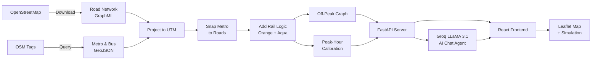

<p align="center">
  
</p>

<h1 align="center">🚦 V-NEURON</h1>

<p align="center">
  <strong>Unified Omnimodal Urban Navigation & Routing System for Nagpur</strong>
</p>

<p align="center">
  <a href="#-features"></a>
  <a href="#-tech-stack"></a>
  <a href="LICENSE"></a>
  <a href="https://github.com/Macbeth1501/V-NEURON"></a>
  
  
</p>

---

## 📌 About

**V-NEURON** is a state-of-the-art multimodal routing engine and interactive visualization platform designed specifically for **Nagpur, Maharashtra, India**. It consolidates Nagpur's **road network**, **walking pathways**, **metro rail infrastructure** (Orange & Aqua lines), and **bus transit stops** into a single, unified, weighted routing graph.

By evaluating journeys across both **free-flow (Off-Peak)** and **congested (Peak-Hour)** traffic scenarios, V-NEURON provides:

- 🛣️ High-fidelity multimodal route planning
- 🔄 Transfer indexing across transit modes
- 🚗 Real-time vehicle tracking simulation
- 🤖 Stateful **Agentic AI Chatbot** assistant (powered by Groq LLaMA 3.1)

> Built as a **Final Year Project (FYP)** at SVPCET, Nagpur, V-NEURON demonstrates how graph theory, geospatial data, and modern AI can transform urban transit planning.

---

## ✨ Features

| Feature | Description |
|---|---|
| **Multimodal Routing** | Combines driving, metro, bus, and walking into a single shortest-path query using Dijkstra's algorithm on a unified NetworkX graph |
| **Dual Traffic Scenarios** | Compare Off-Peak vs Peak-Hour routing with realistic congestion-calibrated speeds |
| **Interactive Map** | Leaflet-based map with dynamic markers for 170+ metro stations, bus stops, landmarks, colleges, and hospitals |
| **Live Vehicle Simulation** | Animated vehicle tracking along computed routes with real-time telemetry (speed, mode, ETA, distance remaining) |
| **Agentic AI Chatbot** | Natural language interface powered by **Groq LLaMA 3.1 8B** — extracts origin, destination, and preferences conversationally |
| **Fuzzy Location Matching** | Robust geocoding with local cache, fuzzy matching, substring search, and Nominatim fallback |
| **Metro Rail Logic** | Full Orange Line (18 stations) & Aqua Line (19 stations) with boarding penalties and transfer costs |
| **Mode-Change Waypoints** | Visual markers on the map where transit mode switches occur (Road → Metro → Walk) |
| **Map Style Toggle** | Switch between Light (CartoDB Voyager) and Satellite (ArcGIS) tile layers |
| **Auto-Recalculate** | Route automatically recalculates when travel mode or time scenario changes |
| **Autocomplete Search** | Type-ahead search across all known locations with categorized suggestions |
| **Data Pipeline** | 9-step automated pipeline: download OSM → project → snap transit → calibrate → audit |

---

## 🏗️ Architecture

```text
V-NEURON/
├── README.md                  # Project handbook (this file)
├── LICENSE                    # MIT License
├── .gitignore                 # Unified git exclusion rules
├── .env.example               # Template configuration file
├── Project Title-2-RRSC.pdf   # Research & academic documentation
│
├── backend/                   # FastAPI Routing Engine & AI Agent API
│   ├── api.py                 # REST API server (endpoints, sessions, CORS, geocoding)
│   ├── routing_engine.py      # Core Dijkstra/shortest-path NetworkX logic
│   ├── config.py              # Single source of truth (speeds, coordinates, paths)
│   ├── pipeline.py            # 9-step data pipeline (OSM → multimodal graph)
│   ├── requirements.txt       # Python environment dependencies
│   ├── locations.json         # Extracted routing interest points
│   └── data/                  # Precompiled Nagpur multimodal graphs & GeoJSONs
│       ├── nagpur_roads.graphml
│       ├── nagpur_roads_projected.graphml
│       ├── nagpur_metro.geojson
│       ├── nagpur_bus_stops.geojson
│       ├── vneuron_multimodal_base.graphml
│       ├── vneuron_omnimodal_final.graphml
│       └── vneuron_calibrated_network.graphml
│
└── frontend/                  # React + Vite Interactive Map Client
    ├── index.html             # HTML entry point
    ├── vite.config.js         # Vite bundler configuration
    ├── package.json           # React dependencies & scripts
    └── src/
        ├── App.jsx            # Main view — map, routing panel, simulation, AI chat
        ├── index.css          # Global stylesheets & design tokens
        └── main.jsx           # React DOM entrypoint
```

---

## 🧠 How It Works



### Data Pipeline Steps

| Step | Action | Output |
|------|--------|--------|
| 1 | Download Nagpur road network from OSM | `nagpur_roads.graphml` |
| 2 | Fetch metro stations & bus stops | `nagpur_metro.geojson`, `nagpur_bus_stops.geojson` |
| 3 | Push raw layers to PostGIS *(optional)* | Database tables |
| 4 | Project all layers to UTM (EPSG:32644) | Projected graphml & geojsons |
| 5 | Push projected layers + spatial indexes *(optional)* | Indexed DB tables |
| 6 | Snap metro stations to road network | `vneuron_multimodal_base.graphml` |
| 7 | Add Orange & Aqua metro rail edges | `vneuron_omnimodal_final.graphml` |
| 8 | Generate peak-hour calibrated network | `vneuron_calibrated_network.graphml` |
| 9 | Comparative route audit (SVPCET → Automotive Sq.) | Console output |

---

## 🛠️ Tech Stack

### Backend
| Technology | Purpose |
|---|---|
| **Python 3.12+** | Core language |
| **FastAPI** | High-performance async REST API |
| **NetworkX** | Graph data structures & Dijkstra routing |
| **OSMnx** | OpenStreetMap data download & graph construction |
| **GeoPandas / Shapely** | Geospatial data processing & CRS projection |
| **Groq SDK** | LLM inference (LLaMA 3.1 8B) for agentic chatbot |
| **Geopy** | Nominatim geocoding fallback |
| **Uvicorn** | ASGI server |

### Frontend
| Technology | Purpose |
|---|---|
| **React 19** | UI framework |
| **Vite 8** | Build tool & dev server |
| **Leaflet / React-Leaflet** | Interactive map rendering |
| **Framer Motion** | Animations & transitions |
| **Lucide React** | Icon library |
| **Axios** | HTTP client |

---

## 🚀 Getting Started

### Prerequisites

- **Python** ≥ 3.12  
- **Node.js** ≥ 20  
- **npm** ≥ 10  
- A **Groq API key** (free at [console.groq.com](https://console.groq.com))

### 1. Clone the Repository

```bash
git clone https://github.com/Macbeth1501/V-NEURON.git
cd V-NEURON
```

### 2. Configure Environment

```bash
cp .env.example .env
# Edit .env and add your Groq API key:
# GROQ_API_KEY=gsk_your_api_key_here
```

### 3. Set Up the Backend

```bash
cd backend

# Create virtual environment
python -m venv venv
source venv/bin/activate        # Linux/macOS
# venv\Scripts\activate         # Windows

# Install dependencies
pip install -r requirements.txt
```

### 4. Build the Routing Graphs *(first time only)*

> ⚠️ This downloads ~80 MB of road data from OpenStreetMap and takes 5–15 minutes.

```bash
python pipeline.py
```

You can resume from a specific step if interrupted:

```bash
python pipeline.py --from-step 6    # Start from step 6
python pipeline.py --only-step 8    # Run only step 8
```

### 5. Start the Backend Server

```bash
python api.py
# or: uvicorn api:app --host 0.0.0.0 --port 8000 --reload
```

The API will be live at **`http://localhost:8000`**. Interactive docs at **`http://localhost:8000/docs`**.

### 6. Set Up & Start the Frontend

```bash
cd ../frontend

npm install
npm run dev
```

The app will be live at **`http://localhost:5173`**.

---

## 📡 API Reference

### `POST /route`

Calculate a multimodal route between two locations.

```json
{
  "source": "VNIT",
  "destination": "Nagpur Junction",
  "isPeakHour": false,
  "travelMode": "all"
}
```

**Response:** Route segments with coordinates, distance, travel time, and highway type.

### `POST /chat`

Interact with the Agentic AI navigation assistant.

```json
{
  "prompt": "I want to go from Airport to Sitabuldi during rush hour",
  "session_id": "abc123"
}
```

**Response:** Conversational reply + extracted parameters + computed route (if both source & destination are set).

### `GET /markers`

Fetch all metro stations and bus stops for map rendering.

---

## ⚙️ Configuration

All project configuration is centralized in [`backend/config.py`](backend/config.py):

| Parameter | Default | Description |
|---|---|---|
| `CENTER_LATLON` | `(21.1458, 79.0882)` | Map center coordinates (Nagpur) |
| `RADIUS_M` | `45,000` | OSM data download radius in meters |
| `CRS_PROJECTED` | `EPSG:32644` | UTM Zone 44N (correct for Nagpur) |
| `METRO_SPEED_KMH` | `33` | Average Nagpur Metro speed |
| `WALKING_SPEED_MPS` | `1.25` | Walking speed (~4.5 km/h) |
| `BOARDING_PENALTY_S` | `300` | 5-minute boarding penalty per transit transfer |
| `SPEEDS_FREE_FLOW` | *see config* | Free-flow road speeds by highway class |
| `SPEEDS_PEAK_HOUR` | *see config* | Peak-hour congested speeds by highway class |

---

## 🗺️ Supported Locations

V-NEURON supports **170+ locations** across Nagpur, including:

- 🚇 **Metro Stations** — All 37 stations on Orange & Aqua lines
- 🚌 **Bus Stops** — 80+ MSRTC & city bus stops
- 🎓 **Colleges** — VNIT, RKNEC, YCCE, Hislop, G.H. Raisoni, Symbiosis, and more
- 🏥 **Hospitals** — AIIMS, Orange City, Wockhardt, Mayo, Alexis, and more
- 🏛️ **Landmarks** — Deekshabhoomi, Zero Mile, Sitabuldi Fort, Gorewada Zoo
- 🛍️ **Malls** — Empress Mall, Eternity Mall, Lokmat Square Mall
- 🏘️ **Neighbourhoods** — Dharampeth, Sadar, Civil Lines, Manish Nagar, and 30+ more

---

## 📊 Performance

| Metric | Value |
|---|---|
| Graph Nodes | ~110,000+ (road + transit) |
| Graph Edges | ~250,000+ |
| Metro Stations Connected | 37 |
| Bus Stops Indexed | 80+ |
| Route Computation | < 500ms typical |
| Geocoding (local cache) | < 1ms |
| AI Response (Groq) | ~1–2s |

---

## 🤝 Contributing

Contributions are welcome! Here's how to get started:

1. **Fork** the repository
2. **Create** a feature branch (`git checkout -b feature/amazing-feature`)
3. **Commit** your changes (`git commit -m 'Add amazing feature'`)
4. **Push** to the branch (`git push origin feature/amazing-feature`)
5. **Open** a Pull Request

Please ensure your code follows the existing style and includes appropriate documentation.

---

## 📄 License

This project is licensed under the **MIT License** — see the [LICENSE](LICENSE) file for details.

---

## 🙏 Acknowledgements

- **[OpenStreetMap](https://www.openstreetmap.org/)** — Road network & transit data
- **[OSMnx](https://github.com/gboeing/osmnx)** — Graph construction from OSM
- **[NetworkX](https://networkx.org/)** — Graph algorithms
- **[Leaflet](https://leafletjs.com/)** — Interactive map rendering
- **[Groq](https://groq.com/)** — Ultra-fast LLM inference
- **[FastAPI](https://fastapi.tiangolo.com/)** — Modern Python web framework
- **Nagpur Metro Rail Corporation** — Metro station data

---

<p align="center">
  <sub>Built with ❤️ for Nagpur</sub>
</p>